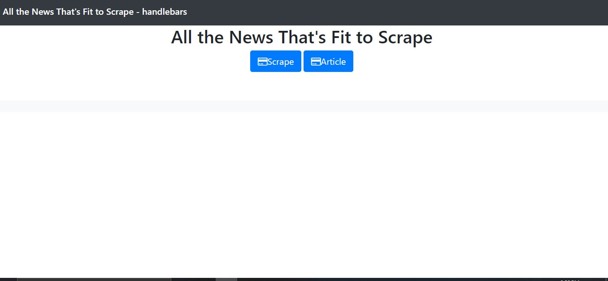
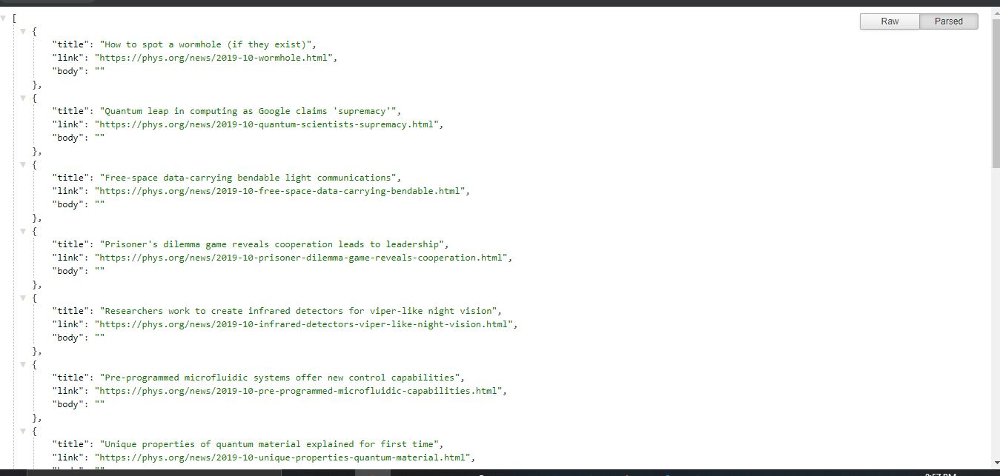
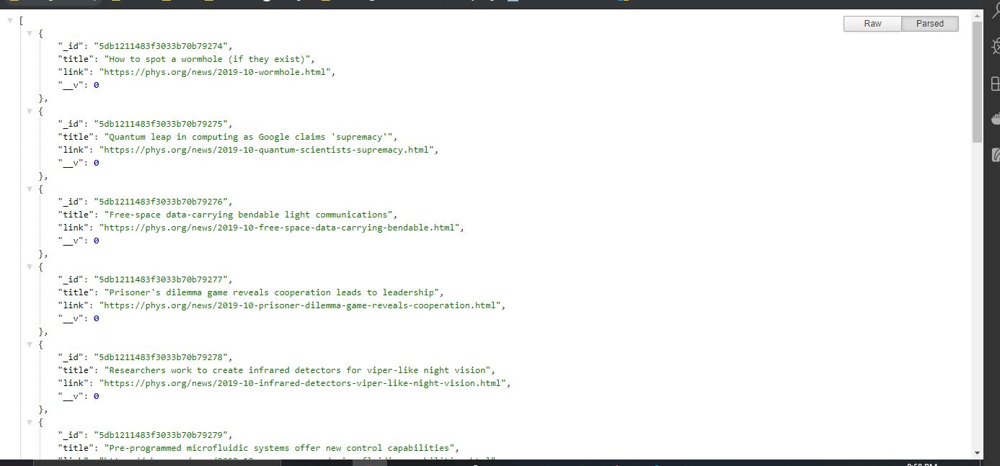
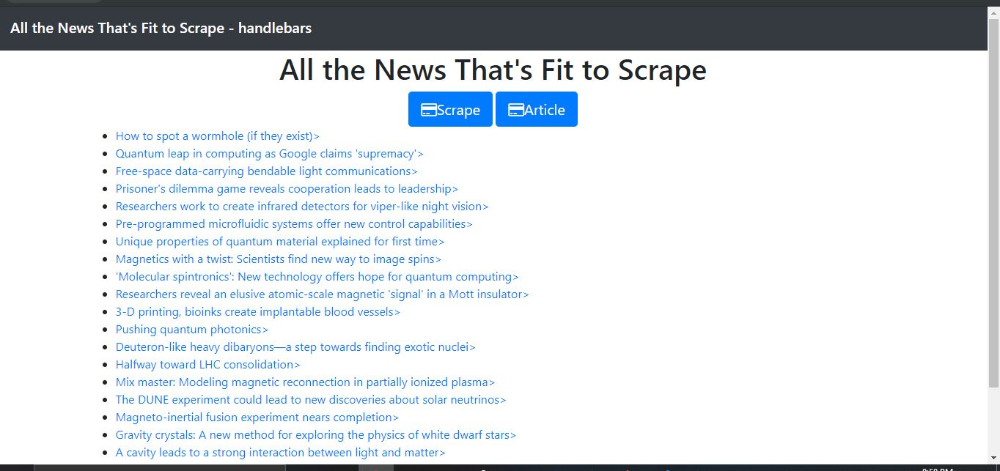

# All the News That's Fit to Scrape

### Overview

In this assignment, you'll create a web app that lets users view and leave comments on the latest news. But you're not going to actually write any articles; instead, you'll flex your Mongoose and Cheerio muscles to scrape news from another site.

### 1st step: Launch program from localhost:300
  
### 2nd step: Click scrape button to scrape article from Phys.org
  
### 3rd step: Click article button to store article into Mongo database
  
### 4rd step: Return to main.handlebars page and refresh
  